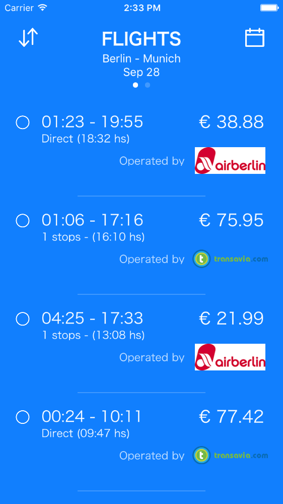

# Fantastic-funicular

####Description
Demo Objective-C project made for goEuro. 

Scope limited for only showing flights and trains information.

Consuming the information of the current flights and trains. Later, processed, displayed and persisted locally. Asynchronous loading of logo images and sorting list elements. 

( The sorting feature was implemented with Swift ).

####Development configuration
Xcode 7.3

####Third-Party Libraries
None

####Screen capture

